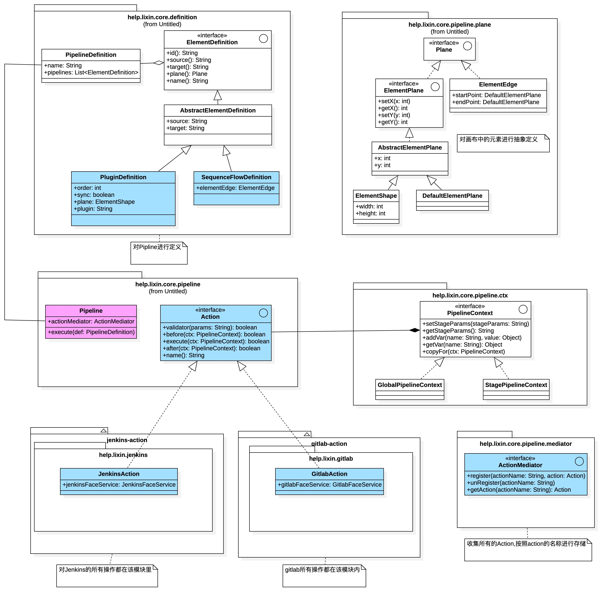
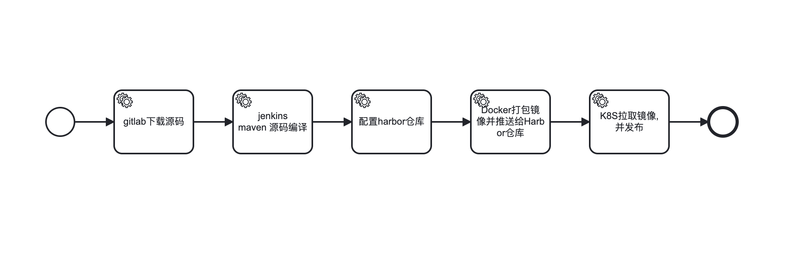

### 1. 项目背景
大概是在三年前,公司让我和一同事去负责一个项目,我们在谈论微服务时,他提出了一个疑问我觉得非常好,微服务之后:<br/>
看日志要用:Kibana,持续集成要用:Jenkins,维护定时任务要用:xxl-job-admin... <br/>
难道就没有一个统一的开源平台,进行统一管理吗?而,该项目就是解决这个问题.  

### 2. 罗列组件
1) 仓库
   gitlab/git/svn

2) 持续集成
   jenkins

3) 技术组件
   nacos/apollo/xxl-job/Skywalking/kibana/rocketmq-console

4) 运维组件
   Harbor/K8S/Promethues/Grafana/Jumpserver

### 3. 解决思路
实现思路比较简单,通过统一的平台,去管理所有的组件,而不是在不同的组件之间进行登录切换,并且,要做到统一的鉴权中心.     

1) 对各个组件的api进行了解.
2) 对业务模型进行抽象,各个组件只是实现的形式而已,亦方便以后支持更多的组件.    
3) 可以自由选择组件,而非,只支持一种组件(比如:gitlab/git/gitee...).  
4) 实现鉴权(细到数据行),并且,同步到各个组件里(比如:gitlab).   

### 4. 各组件API罗列
1) [Jenkins API](https://www.lixin.help/2022/05/07/Jenkins-Api.html)
2) [Nacos API](https://nacos.io/zh-cn/docs/open-api.html)
3) [Harbor API](https://editor.swagger.io/?url=https://raw.githubusercontent.com/goharbor/harbor/main/api/v2.0/legacy_swagger.yaml)
4) [Gitlab API](https://github.com/gitlab4j/gitlab4j-api)
5) [Git API](https://docs.github.com/zh/enterprise-cloud@latest/rest/guides/getting-started-with-the-rest-api)
6) [Eureka API](https://github.com/Netflix/eureka/wiki/Eureka-REST-operations)

### 5. 设计图纸


### 6. 流水线定义案例
> 后期需要前端配合,像工作流那样,运维通过画布组合大量的组件,实现流水线的编排.    

```
[
  {
    "clazz": "help.lixin.core.definition.impl.PluginDefinition",
    "id": "1",
    "name": "gitlab下载源码",
    "source": null,
    "target": "2",
    "plugin": "gitlab",
    "params": "{  \"url\" : \"ssh://git@103.215.125.86:2222/order-group/spring-web-demo.git\" , \"branch\" : \"main\" }"
  },
  {
    "clazz": "help.lixin.core.definition.impl.SequenceFlowDefinition",
    "id": "2",
    "name": "流水线-1",
    "source": "1",
    "target": "3",
    "params": ""
  },
  {
    "clazz": "help.lixin.core.definition.impl.PluginDefinition",
    "id": "3",
    "name": "jenkins maven 源码编译",
    "source": "2",
    "target": "4",
    "sync": true,
    "plugin": "jenkins",
    "params": "{  \"templateFile\" : \"/Users/lixin/GitRepository/spider-web-platform/admin/src/test/resources/java-service-template.xml\" , \"credentialId\" : \"zhangsan\" , \"compile\" : \"maven\" , \"cmd\" : \"mvn clean install -DskipTests -X\" , \"archiveArtifacts\" : \"target/*.jar\" }"
  },
  {
    "clazz": "help.lixin.core.definition.impl.SequenceFlowDefinition",
    "id": "4",
    "name": "流水线-2",
    "source": "3",
    "target": "5"
  },
  {
    "clazz": "help.lixin.core.definition.impl.PluginDefinition",
    "id": "5",
    "name": "配置harbor仓库",
    "source": "4",
    "target": "6",
    "sync": true,
    "plugin": "harbor"
  },
  {
    "clazz": "help.lixin.core.definition.impl.SequenceFlowDefinition",
    "id": "6",
    "name": "流水线-3",
    "source": "5",
    "target": "7"
  },
  {
    "clazz": "help.lixin.core.definition.impl.PluginDefinition",
    "id": "7",
    "name": "Docker打包镜像并推送给Harbor仓库",
    "source": "6",
    "target": null,
    "sync": true,
    "plugin": "shell",
    "params" : "{  \"cmds\":[  \" cd ${ARTIFACT_DIR} \" , \" docker build -f ${DOCKER_FILE} --build-arg APP_FILE=${ARTIFACT_NAME}  -t ${projectName}:v${SECOND} . \" , \" docker login ${REPOSITORY_URL} -u ${REPOSITORY_USERNAME} -p ${REPOSITORY_PASSWORD} \" , \" docker tag ${projectName}:v${SECOND}  ${REPOSITORY_URL}/${projectName}/${projectName}:v${SECOND} \" , \" docker push ${REPOSITORY_URL}/${projectName}/${projectName}:v${SECOND} \"  ] }"
  }
]
```

### 7. 为什么要自定义流水线
在设计时,有考虑过是否要向Jenkins靠拢,即:把流水进行转换成jenkis中的stage,但是,后来考虑了一下,这样做的话,会太过于依赖jenkins了,后来决定,还是自己做pipline,然后,把jenkins当成流水线中的一个小步骤,实际,这样做与jenkins之间的打通,也还是需要时间的.  

### 8. 项目结构
```
lixin-macbook:spider-web-platform lixin$ tree -L 2
.
├── LICENSE
├── README.md
├── actions                     # action组件集合(jenins/gitlab/harbor....)
│   ├── gitlab-action
│   ├── harbor-action
│   ├── jenkins-action
│   └── pom.xml
├── admin                       # 将来的后台系统,统一界面. 
│   ├── pom.xml
│   ├── src
│   └── target
├── api-parent                   # 在第一阶段,用于api测试的代码,到最后,action完成后,这些api测试代码会移除
│   ├── docker-api
│   ├── eureka-api
│   ├── gitlab-api
│   ├── harbor-api
│   ├── jenkins-api
│   ├── nacos-api
│   ├── pom.xml
│   └── xxl-job-api
├── core                        # pipline的核心代码定义
│   ├── pom.xml
│   ├── src
│   └── target
├── docs                        # 所有软件的安装以及配置过程
│   ├── GitLab-Guide.md
│   ├── Harbor-Install.md
│   ├── Jenkins-Guide.md
│   ├── Nacos-Guide.md
│   ├── desgin
│   ├── gitlab
│   └── jenkins
└── pom.xml
```

### 9. 各Action详解
#### 1) Gitlab

Gilab的Action比较简单,只是设置相关变量(项目名称/分支/仓库地址)即可,为什么这么简单?因为:Gitlab提供了大量的Api给前端,由前端辅助用户选择:项目和分支,并将选择结果交给后端保存.  

```
# 这些信息,gitlab里有大量的api,由前端去获取即可.
# projctName: 对应gitlab里的project
# branch : 对应gitlab里的分支
# url    : project具体的位置
{
  "projectName": "spring-web-demo",
  "branch" : "main",
  "url" : "ssh://git@103.215.125.86:2222/order-group/spring-web-demo.git"
}
```


#### 2) Jenkins

Jenkins的Action比较复杂: 

+ 2.1) 根据:项目名称+分支名称,判断在Jenkins中是否存在,如果不存在,则创建Job,并,获了Job的基本信息(JobInfo,其中:nextBuildNumber代表下一次构建的id).
+ 2.2) 如果(项目名称+分支名称)在Jenkins中存在,则,获了项目的基本信息(JobInfo,其中:nextBuildNumber代表下一次构建的id).
+ 2.3) 触发Job构建,在构建从上下文中获得参数(这些参数是在gitlab里设置的:项目名称/分支/仓库地址).
+ 2.4) 拿着JobInfo里的nextBuildNumber轮询去拿到"构建信息(BuildInfo)",在"构建信息"结果,里有一个信息(result),result有三个状态:Null:代表仍在构建中/FAILURE:代表构建失败/SUCCESS:代表构建成功.
+ 2.5) 在"构建信息"里还有一个重要的对象:Artifact,是代表构建成功后的成品位置(这个成品位置要求你自己填写,比如:target/*.jar),通过jenkins api下载"成品"信息保存到磁盘上(建议共享磁盘),并把磁盘位置信息保存到线程上下文里.
+ 2.6) Jenkins Action的参数如下:
```
# templateFile       :   jenkins内部在创建job时,实际是在workspace目录里创建一个文件夹,并为这个文件夹配置一个xml,这个xml存储的就是我们在jenkins界面配置的所有内容,这里的xml是一个模板内容. 
# credentialId       :   凭证id,需要运维预先在jenkins里配置好,我这里代表的是gitlab的账号和密码凭证.  
# cmd                :   要执行的命令
# archiveArtifacts   :   构建成功后,最后的成品库位置.  

{
  "templateFile" : "/Users/lixin/GitRepository/spider-web-platform/admin/src/test/resources/java-service-template.xml",
  "credentialId" : "gitlab",
  "cmd" : "mvn clean install -DskipTests -X",
  "archiveArtifacts" : "target/*.jar"
}
```

+ 2.7) Jenkins不足处:
   + 2.7.1) 需要预先在Jenkins里大量的配置(比如:插件安装/凭证配置/jdk/maven/gradle/nodejs/gitlab),运维人员都能参与到这份上了,与我的想法差别还是比较大的,后期的想法是去掉Jenkins自己去拉取代码下来,调用:Docker根据不同的环境(java/android/ios)来编译.
   + 2.7.2) 为什么我要把"成品"下载下来,原因只有一个,我不能让后面的action与jenkins有太大的交互了,比如:后面我需要对"成品"进行二次加工,制作成docker镜像. 

+ 2.8) Jenkins提供可引用的变量

```
ARTIFACT_DIR         :          /Users/lixin/GitRepository/spring-web-demo/target    
ARTIFACT_NAME        :          spring-web-demo-1.1.0.jar 
ARTIFACT_FULL_PATH   :          /Users/lixin/GitRepository/spring-web-demo/target/spring-web-demo-1.1.0.jar
DOCKER_FILE          :          application.properties里配置(jenkins.dockerFile=/Users/lixin/GitRepository/spider-web-platform/admin/src/main/resources/Dockerfile)
```

#### 3) Harbor
Harbor现在的做法,是把仓库地址/账号/密码塞在上下文里,这些信息,可以在流水线里配置,也可以不用配置,不配置会默认读取application.properties里的.

Harbor提供可引用的变量

```
HTTP_REPOSITORY_URL  :   http://103.215.125.86:3080 
REPOSITORY_URL       :   103.215.125.86:3080
REPOSITORY_USERNAME  :   admin
REPOSITORY_PASSWORD  :   XXXXX
```

#### 4) Shell

Shell的做法会比较简单,你可以传递一组cmd,进行执行,以下为案例. 

```
{
  cmds:[
     " cd ${ARTIFACT_DIR} ",
     " docker login ${REPOSITORY_URL} -u ${REPOSITORY_USERNAME} -p ${REPOSITORY_PASSWORD} ",
     " docker build -f ${DOCKER_FILE} --build-arg APP_FILE=${ARTIFACT_NAME}  -t ${projectName}:v${SECOND} .  ",
     " docker tag ${projectName}:v${SECOND}  ${REPOSITORY_URL}/${projectName}/${projectName}:v${SECOND} ",
     " docker push ${REPOSITORY_URL}/${projectName}/${projectName}:v${SECOND} "
  ]
}
```

#### 5) Gloabl变量

```
YEAR     : 年
MONTH    : 月
DAY      : 日
HOUR     : 小时
MINUTE   : 分钟
SECOND   : 秒钟
DATETIME : yyyy-MM-dd HH:mm:ss
```

### 10. 未来规划
现有不足点:
1). 现在只支持DSL(JSON)的方式,进行流程管理,并且流程管理是串行的.为什么会这样?因为,整个模型框架只用了一上午做的设计,考虑太多(包括流程重试/流程日志记录),会让代码没法往下实现,首要任务是能否实现思想,而非流程的编排,所以,后面会支持可视化编排.  
2). 由于涉及到流程的编排,自然离不开一整套的生命周期管理,如果自己去开发这一套,开发周期会相当的长,和几个朋友经过激烈的讨论后,后面,的想法是:把自己定义的Pipline向BPMN流程靠拢,即把Pipline转换成BPMN中的Task,这样,每一个节点的处理,由流程引擎去驱动,特别是:将来可能编排过程中会存在并行/人工处理/子流程之类的.  
3). 流程引擎选型问题,Activiti/Flowable/Camunda 7/Camunda 8,其实,我个人是钟意:Camunda 8的,但是,这东西的源码,我只看完了十分之一,感觉怕Hold不住,所以,最终选终是在Flowable与Camunda 7之间做选择,由于我将来还是要向Camunda 8靠拢,所以,我的选择是:Camunda 7.

### 11. Pipeline转换成BPMN


