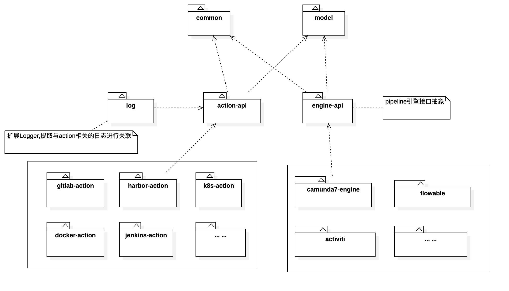
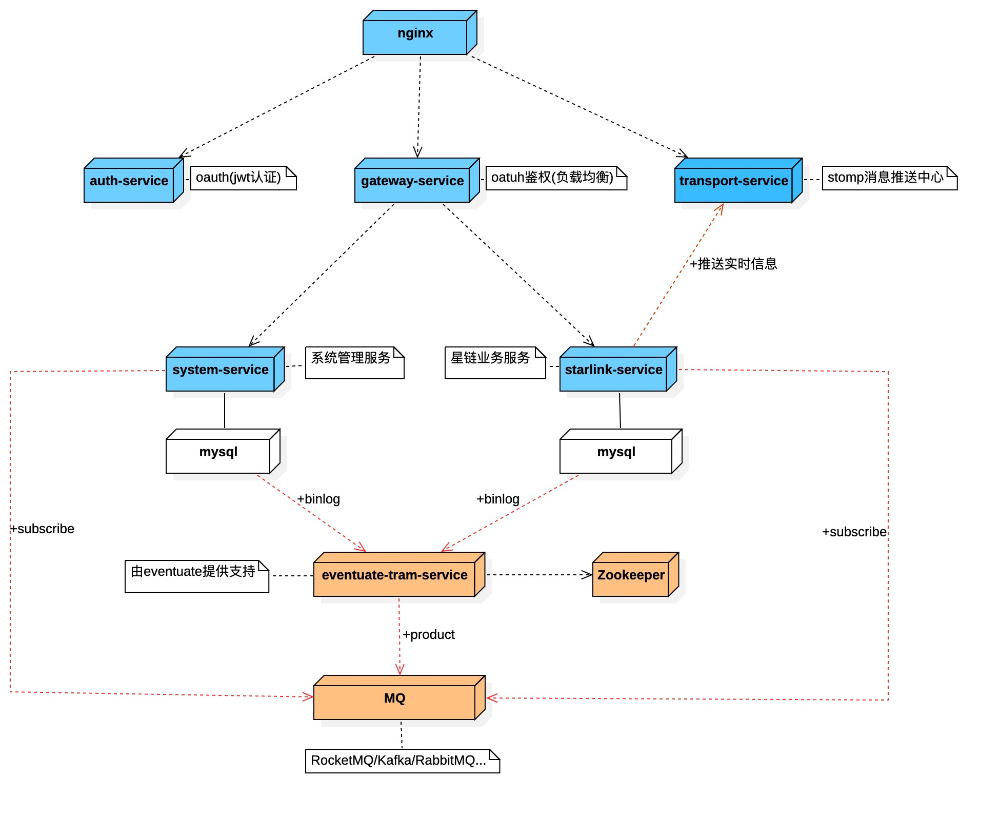

### 1. 项目背景
Starlink（星链）是一款面向企业管理的系统，它绝非一个简单的CI、CD，又或者是一个集成系统，其核心思想是通过该系统，可以打通并管理各个组件（下面列出部份组件），并且，可以通过低代码的形式，实现组件之间的编排。 

### 2. 组件罗列(仅一部份)
1) 项目管理  
   tapd、禅道、jira 
2) 仓库管理 
   gitlab/git/svn
3) 持续集成 
   jenkins
4) 研发组件 
   nacos、eureka、apollo、xxl-job、skywalking、ELK、rocketmq-console、OOM分析、慢SQL监控
5) 质量管控 
   sonarqube、findbugs
6) 测试组件 
    selenium、robot、jmeter
7) 运维组件 
   zabbix、promethues、grafana、nagios、jumpserver、ansible、saltstack、harbor、k8s、docker-swarm、openshift、nexus

### 3. Starlink技术栈

spring boot、mybatis plus、spring cloud gateway、spring security、shedlock、stomp、eventuate、liquibase、BPMN(activiti、flowable、camunda)

### 4. Starlink模块依赖图纸

### 5. Starlink流水线编排设计图纸

### 6. Starlink部署图纸

### 7. Starlink一键部署与使用文档 
[starlink一键部署与使用文档](https://github.com/help-lixin/starlink-docker)

### 8. 联系我们

