### 1. 安装Jenkins
```
# 1. 创建磁盘目录
lixin-macbook:~ lixin$ mkdir -p /opt/docker/jenkins/jenkins-data

# 2. 运行jenkins
lixin-macbook:~ lixin$ docker run \
-u root \
-d \
-p 2080:8080 \
-p 50000:50000 \
-v /opt/docker/jenkins/jenkins-data:/var/jenkins_home \
-v /var/run/docker.sock:/var/run/docker.sock \
--name jenkins \
--restart always \
--privileged=true \
jenkinsci/blueocean
```
### 2. 解锁Jenkins
```
# 进入容器内部
[root@lixin ~]# docker exec -it jenkins /bin/bash

# 查看初始化密码
bash-5.1# cat /var/jenkins_home/secrets/initialAdminPassword
72f5e1a3b7fd4a48b0fddb8bf3b66ede
```

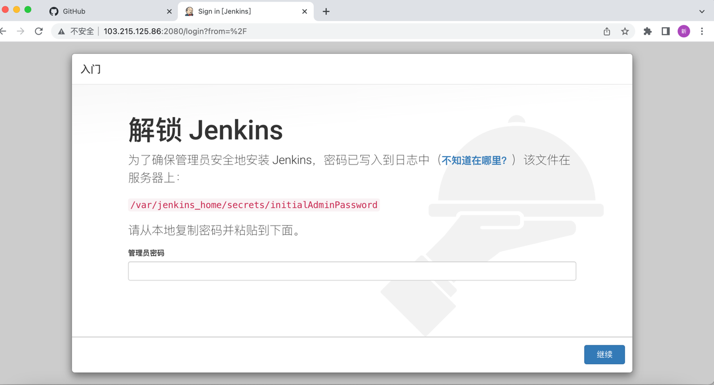

### 2. 自定义Jenkins
> 在这里我选择:安装推荐插件

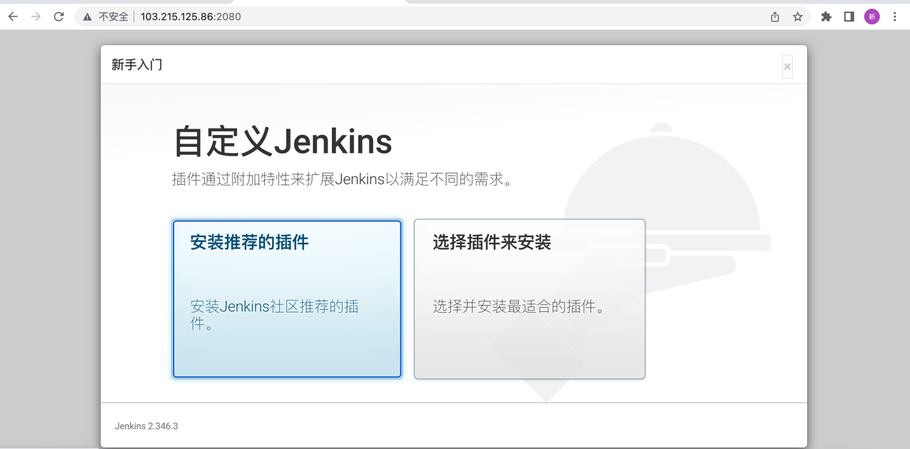


### 3. Jenkins安装推荐插件
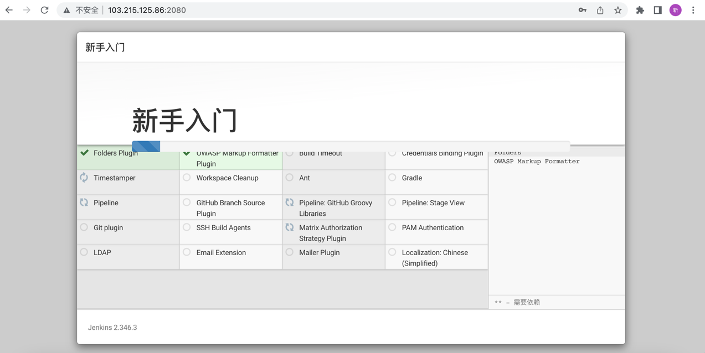

### 4. Jenkins创建管理员账号
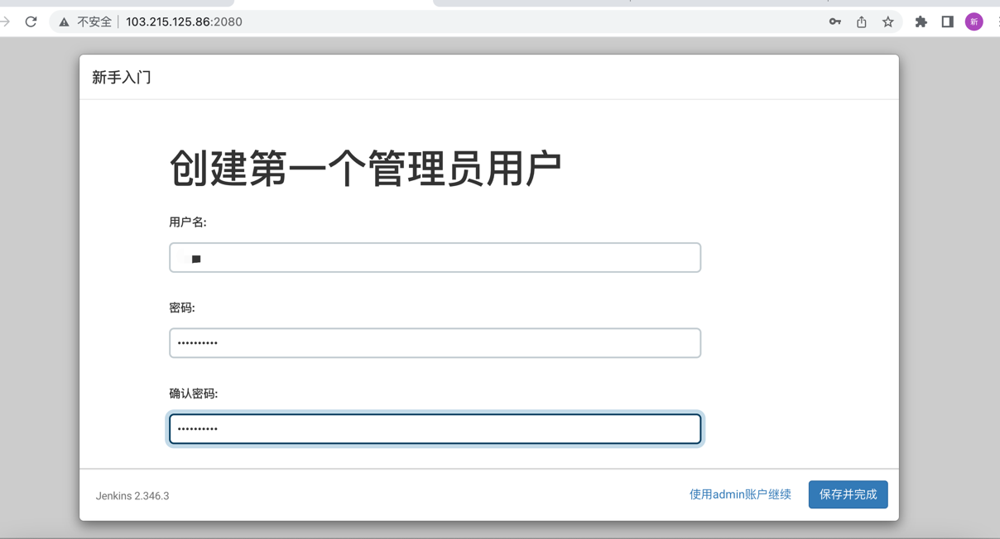

### 5. Jenkins实例配置
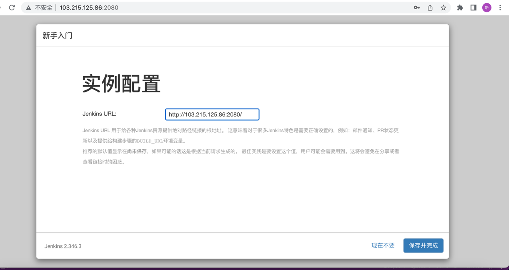

### 6. 全局工具配置
> Dashboard -> 全局工具配置
> 配置JDK时,需要填写Oracle账号.
> 要记住这些名称: jdk8 / git / maven  

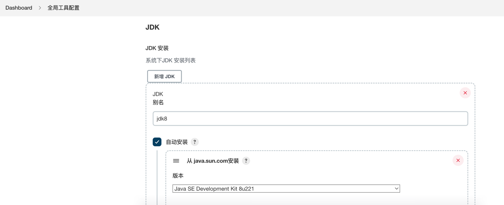

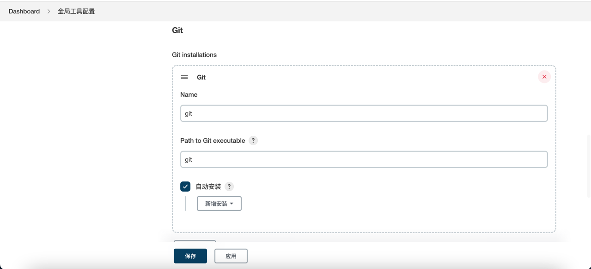

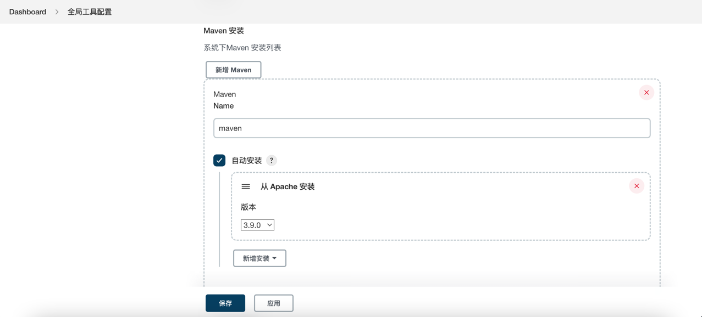

### 7. 添加凭据
> Dashboard --> 系统管理 --> 凭据 --> 系统 --> 全局凭据 (unrestricted)

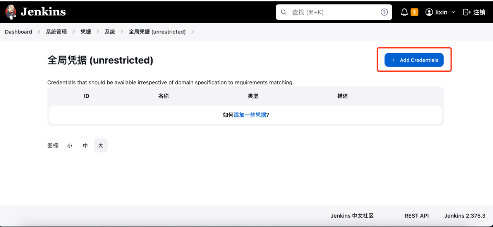

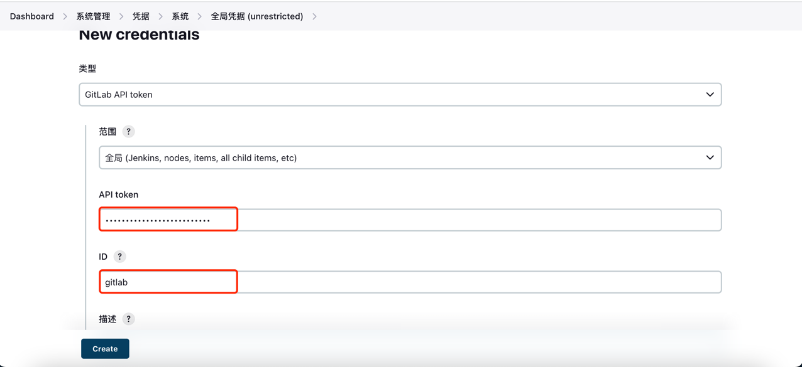


### 8. jenkins配置gitlab
> Dashboard  --> 系统管理 --> Configure System

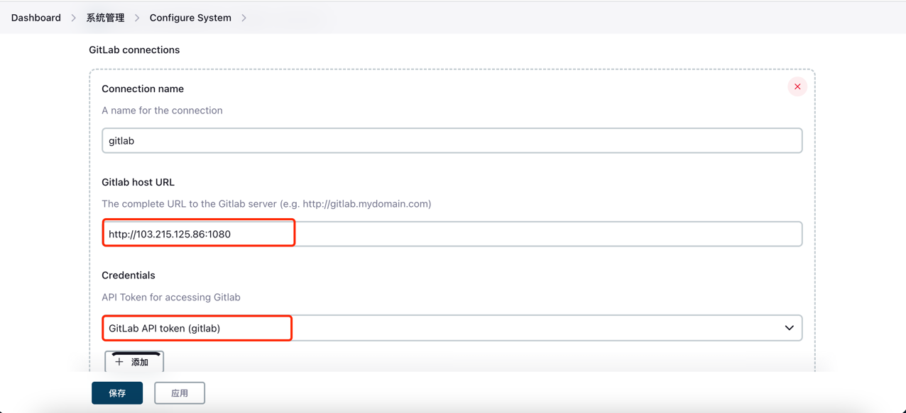

### 9. gitlab配置jenkins的密钥

```
# 1. 进入jenkins容器内部
[root@lixin ~]# docker exec -it  jenkins /bin/bash

# 2. 生产密钥(一路回车即可)
bash-5.1# ssh-keygen

# 3. 查看公钥
bash-5.1# cat /root/.ssh/id_rsa.pub

# 4. 进入到gitlab界面,添加ssh keys
```
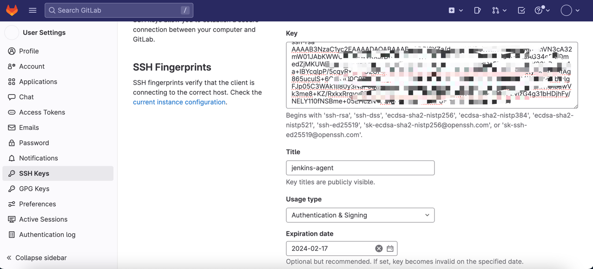


```
# 1. 进入容器内部
[root@lixin ~]# docker exec -it  jenkins /bin/bash

# 2. 查看git版本
bash-5.1# git --version
git version 2.36.2

# 3. 拉取分支
bash-5.1# git fetch --tags --force --progress -- ssh://git@103.215.125.86:2222/order-group/spring-web-demo.git +refs/heads/*:refs/remotes/origin/*
fatal: not a git repository (or any of the parent directories): .git

# 4. 协助初始化一次
bash-5.1# git init
hint: Using 'master' as the name for the initial branch. This default branch name
hint: is subject to change. To configure the initial branch name to use in all
hint: of your new repositories, which will suppress this warning, call:
hint:
hint:   git config --global init.defaultBranch <name>
hint:
hint: Names commonly chosen instead of 'master' are 'main', 'trunk' and
hint: 'development'. The just-created branch can be renamed via this command:
hint:
hint:   git branch -m <name>
Initialized empty Git repository in /var/.git/

# 5. 协助一次拉取元数据
bash-5.1# git fetch --tags --force --progress -- ssh://git@103.215.125.86:2222/order-group/spring-web-demo.git
The authenticity of host '[103.215.125.86]:2222 ([103.215.125.86]:2222)' can't be established.
ED25519 key fingerprint is SHA256:qiOVbBCDGVb5suJSSr7F8DrFtNC+GuPEDunp+vriI+g.
This key is not known by any other names
Are you sure you want to continue connecting (yes/no/[fingerprint])? yes
Warning: Permanently added '[103.215.125.86]:2222' (ED25519) to the list of known hosts.
remote: Enumerating objects: 26, done.
remote: Counting objects: 100% (26/26), done.
remote: Compressing objects: 100% (21/21), done.
remote: Total 26 (delta 3), reused 0 (delta 0), pack-reused 0
Unpacking objects: 100% (26/26), 6.83 KiB | 538.00 KiB/s, done.
From ssh://103.215.125.86:2222/order-group/spring-web-demo
 * branch            HEAD       -> FETCH_HEAD
```

### 9. 安装常见错误
> 1. 无法连接到Jenkins,重启下jenkins,然后,重新登录即可. 

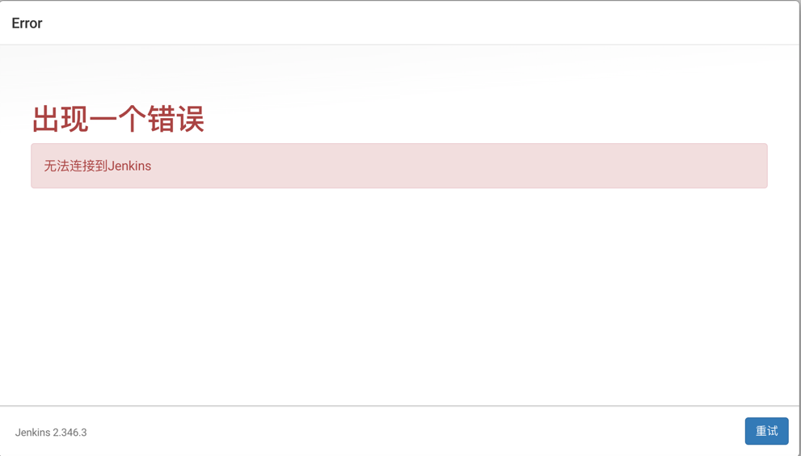

> 2. Host key verification failed(手动进入容器内部,运行git相关命令,会对:known_hosts添加记录).  

```
The recommended git tool is: NONE
No credentials specified
 > git rev-parse --resolve-git-dir /var/lib/jenkins/workspace/spring-web-demo/.git # timeout=10
Fetching changes from the remote Git repository
 > git config remote.origin.url ssh://git@103.215.125.86:2222/order-group/spring-web-demo.git # timeout=10
Fetching upstream changes from ssh://git@103.215.125.86:2222/order-group/spring-web-demo.git
 > git --version # timeout=10
 > git --version # 'git version 1.8.3.1'
 > git fetch --tags --progress ssh://git@103.215.125.86:2222/order-group/spring-web-demo.git +refs/heads/*:refs/remotes/origin/* # timeout=10
ERROR: Error fetching remote repo 'origin'
hudson.plugins.git.GitException: Failed to fetch from ssh://git@103.215.125.86:2222/order-group/spring-web-demo.git
	at hudson.plugins.git.GitSCM.fetchFrom(GitSCM.java:1003)
	at hudson.plugins.git.GitSCM.retrieveChanges(GitSCM.java:1245)
	at hudson.plugins.git.GitSCM.checkout(GitSCM.java:1309)
	at org.jenkinsci.plugins.workflow.steps.scm.SCMStep.checkout(SCMStep.java:129)
	at org.jenkinsci.plugins.workflow.steps.scm.SCMStep$StepExecutionImpl.run(SCMStep.java:97)
	at org.jenkinsci.plugins.workflow.steps.scm.SCMStep$StepExecutionImpl.run(SCMStep.java:84)
	at org.jenkinsci.plugins.workflow.steps.SynchronousNonBlockingStepExecution.lambda$start$0(SynchronousNonBlockingStepExecution.java:47)
	at java.base/java.util.concurrent.Executors$RunnableAdapter.call(Executors.java:515)
	at java.base/java.util.concurrent.FutureTask.run(FutureTask.java:264)
	at java.base/java.util.concurrent.ThreadPoolExecutor.runWorker(ThreadPoolExecutor.java:1128)
	at java.base/java.util.concurrent.ThreadPoolExecutor$Worker.run(ThreadPoolExecutor.java:628)
	at java.base/java.lang.Thread.run(Thread.java:829)
Caused by: hudson.plugins.git.GitException: Command "git fetch --tags --progress ssh://git@103.215.125.86:2222/order-group/spring-web-demo.git +refs/heads/*:refs/remotes/origin/*" returned status code 128:
stdout: 
stderr: Host key verification failed.
fatal: Could not read from remote repository.

Please make sure you have the correct access rights
and the repository exists.

	at org.jenkinsci.plugins.gitclient.CliGitAPIImpl.launchCommandIn(CliGitAPIImpl.java:2734)
	at org.jenkinsci.plugins.gitclient.CliGitAPIImpl.launchCommandWithCredentials(CliGitAPIImpl.java:2111)
	at org.jenkinsci.plugins.gitclient.CliGitAPIImpl$1.execute(CliGitAPIImpl.java:623)
	at hudson.plugins.git.GitSCM.fetchFrom(GitSCM.java:1001)
	... 11 more
```
